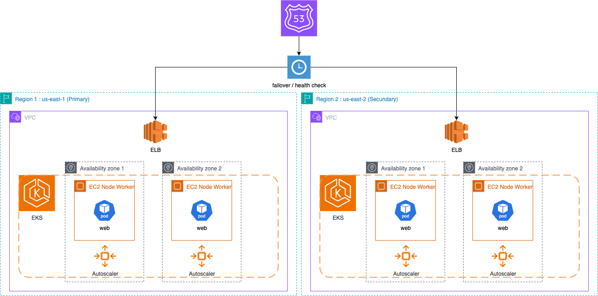
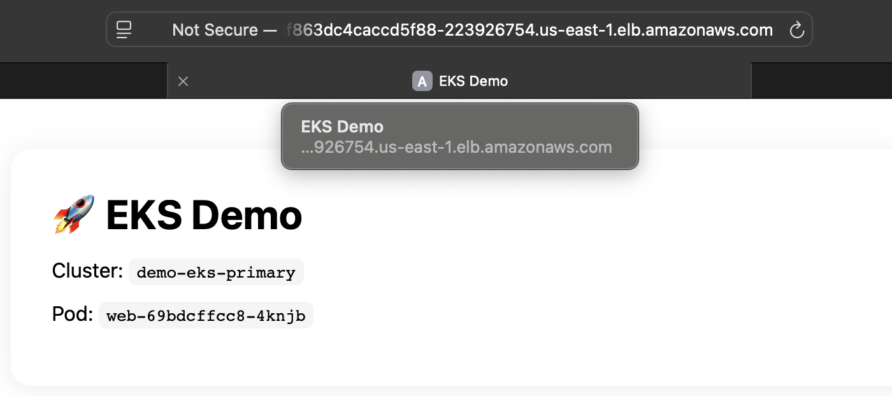
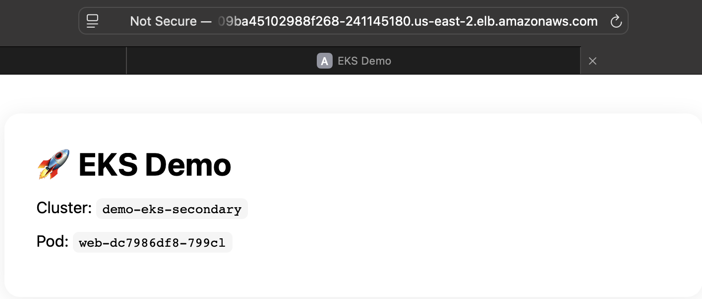
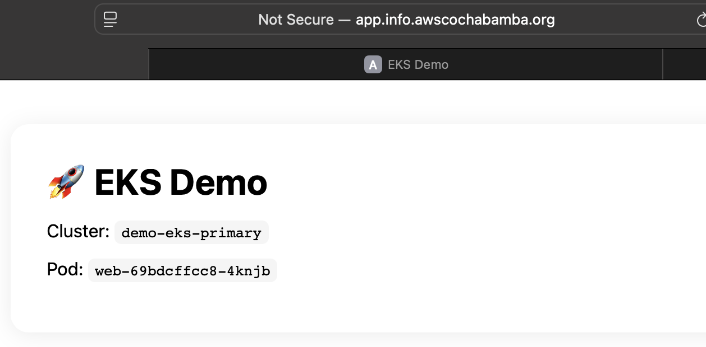
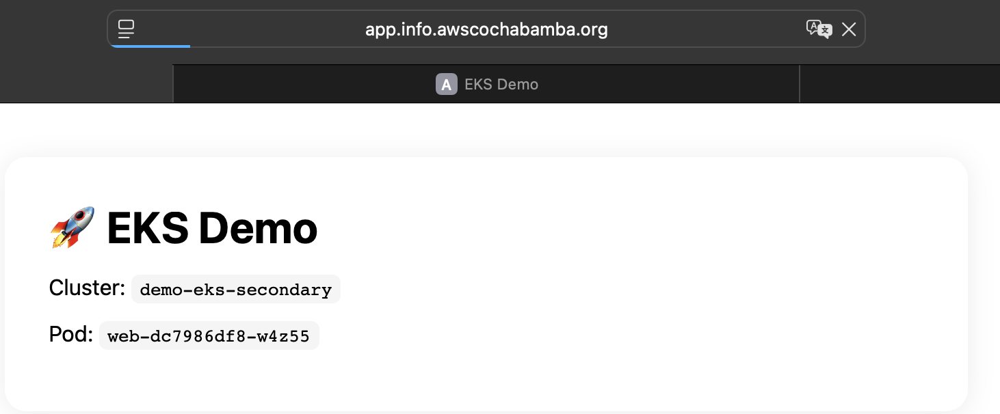

# EKS Multi‑Región (Demo)

Esta demo despliega **dos clústeres EKS** (región primaria/secundaria) e incluye IaC con **Terraform**.

Pensado para ser **simple y económico**.

## Requisitos previos
- AWS CLI y `kubectl` instalados
- Terraform >= 1.6
- GitHub repo con OIDC configurado (rol en AWS)
- Permisos en AWS para EKS/VPC/GA/IAM

## Regiones por defecto
- Primaria: `us-east-1`
- Secundaria: `us-west-2`

## Diagrama

## Demostracion

### Cluster primario

### Cluster secundario

### Sin falla en el primario

### C falla en el primario y cambio al secundario
